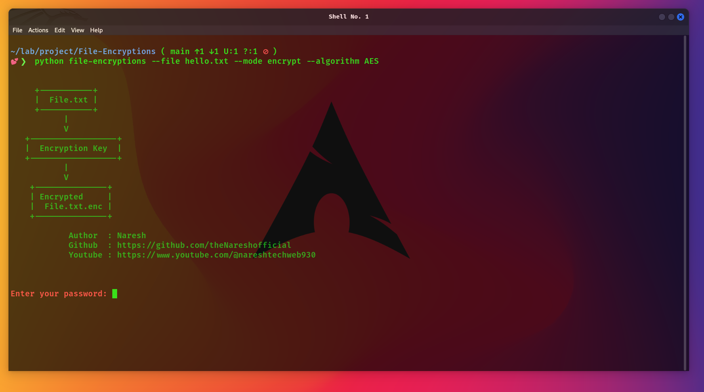

<p align="center">
            
</p>
# File Encryptions Tool

This file encryption tool allows you to securely encrypt and decrypt various text file formats using a customizable security key. The encrypted output is generated with strong cryptographic practices, including the Advanced Encryption Standard (AES), hash functions, and random salt, ensuring robust security. After encrypting, the output file has the same name as the original file with an ".enc" extension. For example, if you encrypt hello.txt, the resulting encrypted file will be hello.txt.enc.

# How it's work

It sounds like you're describing a file encryption tool that uses the Advanced Encryption Standard (AES) algorithm with additional security features like hash functions and random salt to enhance encryption strength. This kind of encryption tool is commonly used to secure sensitive information, ensuring that only those with the correct security key can access the decrypted contents.

# Installtions

``` 
# clone repo
$ git clone https://github.com/theNareshofficial/File-Encryptions.git

# change directory
$ cd File-Encryptions

# Install requirements
$ pip install -r requirements.txt

# Encrypt the file
$ python file-encryption.py --file hello.txt --mode encrypt --algorithm AES

# Decrypt the file
$ python file-encryption.py --file hello.txt.enc --mode decrypt --algorithm AES
```

# Help command
```
# help command
$ python file-encryption.py --help

usage: file-encryptions [-h] --file FILE --mode {encrypt,decrypt} [--algorithm ALGORITHM]

Encrypt or Decrypt a file with a specified algorithm and key.

options:
  -h, --help            show this help message and exit
  --file FILE           Path to the file to encrypt or decrypt.
  --mode {encrypt,decrypt}
                        Whether to encrypt or decrypt.
  --algorithm ALGORITHM   
                        Encryption algorithm to use. Default AES.                                                                      
```

# Tested OS
- Windows
- Linux
- MAC

# Key Concepts

- **AES Algorithm:** AES (Advanced Encryption Standard) is a symmetric encryption algorithm that is widely used for securing data. It offers strong security and is commonly used in various applications, including file encryption tools.

- **Symmetric Encryption:** This type of encryption uses the same key for both encryption and decryption. The security of the encrypted data depends on keeping this key secret.

- **Hash Functions:** A hash function takes an input and produces a fixed-size output (the hash). While hash functions are not inherently designed for encryption, they are often used to create message authentication codes or derive keys.

- **Random Salt:** Salt is random data added to a cryptographic process to make it more resistant to attacks like brute-force or dictionary attacks. It ensures that even if the same data is encrypted multiple times, the resulting encrypted outputs are different.


<h1 align="center">ThankYou🎉</h1>

